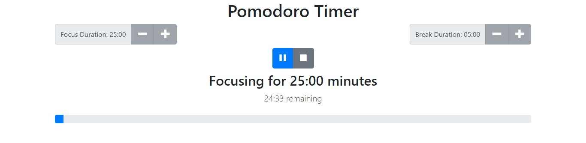
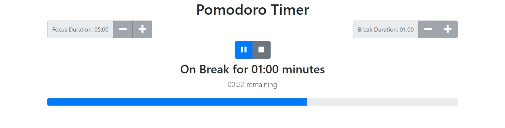

# project-pomodoro-timer
Pomodoro timer is a tool widely used to increase productivity. This is a web application for this tool.
The goal here is to set up intervals for in focus and break time. This app gives you an auditory queue when each interval is over and continues to loop through until stopped by the user.
# How to use

Set the focus and break time and press play.

The app will start the focus time and play a sound when the time is complete.

Then the app will start the break time and play the sound when complete. This loop continues until stop is pressed.

# Technologies used
Javascript/HTML/CSS/React/Bootstrap
